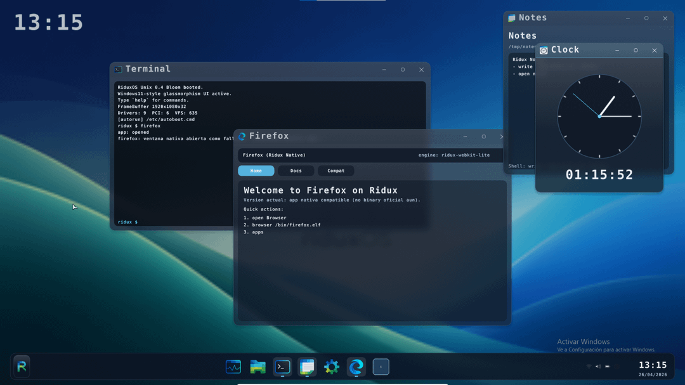

# RiduxOS


RiduxOS is an attempt to build a full operating system from scratch — not just another Linux distro with a custom skin. The goal is to have the kernel, compositor, runtime, apps, and desktop environment all developed within a single cohesive project.

Everything is designed to be understandable, hackable, and self-contained.

---

## Current State



- x86_64 kernel with Multiboot2 boot
- Custom framebuffer + 2D renderer (Flush)
- Windowing system and desktop environment
- Native Ring 3 applications (terminal, files, settings, etc.)
- Linux compatibility layer (in progress)
- X11 / Wayland bridge (work-in-progress)
- Initrd-based rootfs with overlay system

---

## Project Structure

```text
src/kernel.c                  kernel entry point
src/kernel/                   kernel modules
src/compat/                   Linux-like runtime / compatibility
src/flush.c                   renderer
src/ridux_r3wm.h              window protocol (Ring 3)
tools/                        build tools and utilities
scripts/                      boot and debug scripts
grub/                         boot config
rootfs/                       filesystem inside initrd
```

---

## Build

Requirements: gcc, make, grub-mkrescue, xorriso

Build kernel only:

```bash
make kernel
```

Build userspace / initrd:

```bash
make initrd
```

Build full ISO:

```bash
make iso
```

Clean build:

```bash
make clean
```

---

## Run (VirtualBox example)

```bash
VBoxManage createvm --name RiduxOS --register
VBoxManage modifyvm RiduxOS --memory 2048 --cpus 2
VBoxManage storagectl RiduxOS --name "IDE" --add ide
VBoxManage storageattach RiduxOS --storagectl "IDE" --port 0 --device 0 --type dvddrive --medium build/RiduxOS.iso
VBoxManage startvm RiduxOS
```

---

## Notes

- The UI is functional but still evolving
- Running real-world applications (e.g. browsers) requires significant compatibility work
- SMP and GPU drivers are still under development

---

## Philosophy

- Keep changes small and testable
- Avoid unnecessary full rebuilds
- Improve structure before optimizing
- Keep the system understandable

---

## Author

Part of the Korinel project
